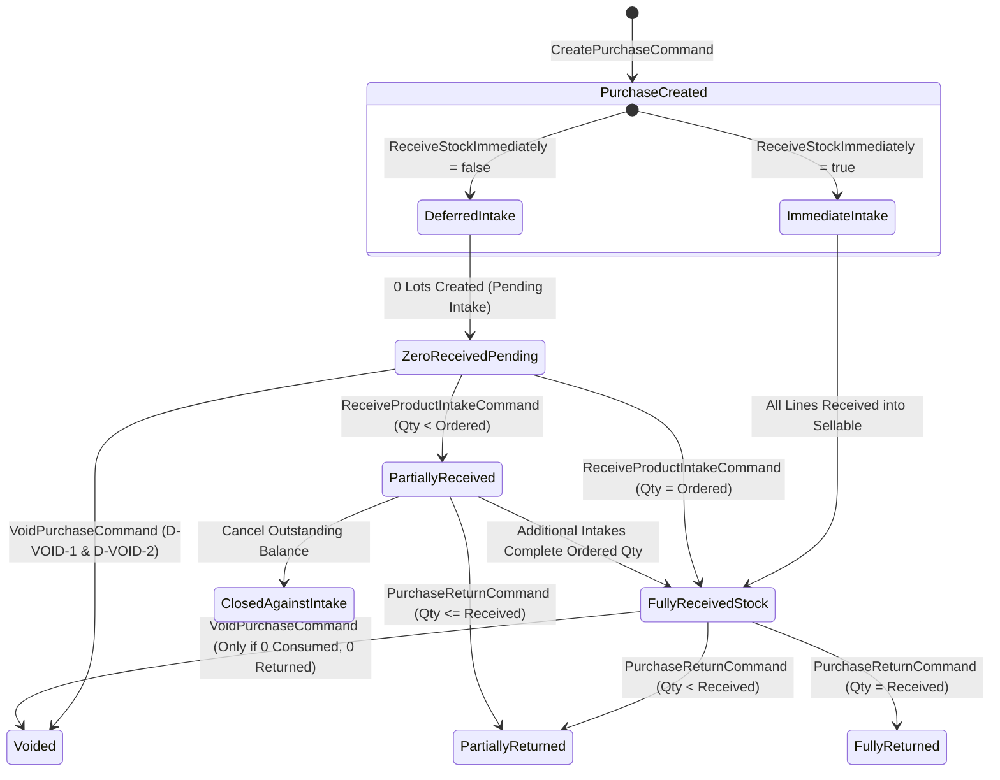

# EDGE RETAILS — PROGRAM PHASE 7
# PASS 1 — STEP 1: DEEP FORENSIC AUDIT
# PURCHASING, EXPENSE, CASH DRAWER & SUPPLIER LEDGER INTEGRITY

**Execution Mode:** STRICT READ-ONLY FORENSIC AUDIT  
**Target Workspace:** `C:\Users\muham\OneDrive\Desktop\Point of Sale`  
**Authoritative Program Phase:** Phase 7 (Business Mutation, Stock & Accounting Integrity)  
**Execution Pass:** Pass 1 (Purchasing, Expenses & Drawer Cash)  
**Audit Date:** 2026-10-03  

---

## 1. EXECUTIVE VERDICT

```text
═══════════════════════════════════════════════════════════════════════════════
                      PASS1_READY_FOR_IMPLEMENTATION
═══════════════════════════════════════════════════════════════════════════════
```

### Forensic Proof Summary
1. **D-VOID-1 (Unreceived Purchase Void):** Confirmed in live code (`VoidPurchaseHandler.cs:159-168`). Lot position queries return 0 lots when `ReceiveStockImmediately == false`, triggering false `void_stock_consumed` failures. The contract for bypassing lot checks when `alreadyReceived == 0` is mathematically proven.
2. **D-VOID-2 (Purchase Void Financial Compensation):** Confirmed in live code (`VoidPurchaseHandler.cs:262-282`). Voiding leaves `CashDrawerReversalAmount = null`, fails to reverse cash payments into the active drawer, and leaves supplier khata payables uncompensated. The dual-path contract (Physical Cash Refund vs Supplier Advance) is resolved.
3. **D-EXP-1 (Expense Void Cash Restoration):** Confirmed in live code (`ExpenseHandlers.cs:201-252`). `PostExpenseHandler` correctly writes `ExpenseCashOut`, but `VoidExpenseHandler` does not inject `ICashMovementService` and omits cash drawer restoration. The current-session cash intake contract is established.
4. **D-RET-1 (Purchase Return Cash Settlement):** Confirmed in live code (`PurchaseReturnHandler.cs:375-398`). `SettlementMode == CashDrawer` writes `PurchaseReturnCredit` to supplier khata but omits `CashMovementType.PurchaseReturnCashIn`. The balancing supplier refund entry is established.
5. **P7-N01 (Partial-Receipt Return Quantity Authority):** Confirmed in live code (`PurchaseReturnHandler.cs:265`). Return limits compare against ordered `item.BaseQuantity` instead of received base quantity. The canonical return cap equation is verified.
6. **Zero Migration Requirement:** Confirmed. All required tables (`purchasing.purchase_voids`, `finance.cash_movements`, `finance.supplier_account_entries`, `finance.supplier_payments`, `finance.supplier_payment_reversals`) and their columns/constraints already exist.
7. **Tracking Authority Impact:** Exactly **NONE (0)**. Tracking remains 100% frozen.

---

## 2. PROGRAM AUTHORITY & ARCHITECTURAL BOUNDARY CONFIRMATION

### Authoritative Program Sequence
$$\text{Phase 1} \to \text{Phase 2} \to \text{Phase 3} \to \mathbf{Phase\ 7} \to \text{Phase 12} \to \text{Phase 8} \to \text{Phase 9} \to \text{POS Acceptance} \to \text{Phase 4} \to \dots \to \text{Phase 13}$$
- **Phase 11 (Tracking & Container-Pack Architecture):** Already completed, independently challenged, and certified frozen under `TRACKING_CERTIFIED_FROZEN_LOCK_CANDIDATE`. It is not repeated or modified.
- **Phase 12 Handover:** `P12-H01` (Replay-before-current-validation) and `P12-H02` (Canonical payload fingerprint uniformity) remain strictly owned by Phase 12.
- **Phase 8 Handover:** `F13` (Shop Timezone / BusinessDate authority) and register concurrency lease retry policies remain strictly owned by Phase 8.

### V1 Commercial Boundary
Edge Retails V1 is strictly:
- **SINGLE SHOP**
- **SINGLE PRIMARY INSTALLATION**
- **SINGLE MACHINE COMMERCIAL POS**
All distributed concepts (multi-branch replication, offline mesh, peer-to-peer sync, LAN multi-workstation authority, seat quotas, customer AR khata) are permanently barred from Phase 7.

---

## 3. PURCHASE STATE MACHINE & LIFECYCLE RECONSTRUCTION

From live code inspection of `PurchasingModels.cs`, `CreatePurchaseHandler.cs`, `ReceiveProductIntakeHandler.cs`, `PurchaseReturnHandler.cs`, and `VoidPurchaseHandler.cs`, the true domain states and properties are:



### State Property Mapping

| Logical State | `Purchase.Status` | Lots in DB? | `InventoryUnit`s? | Total Received | Outstanding Qty | Valid Next Mutations |
|---|---|---|---|---|---|---|
| **Immediate Intake (Full)** | `Completed` | YES | YES (if physical) | `OrderedQty` | `0` | Return, Full Void (if 0 consumed/returned) |
| **Deferred (Zero Intake)** | `Completed` | NO | NO | `0` | `OrderedQty` | Product Intake, Full Void (D-VOID-1) |
| **Partial Intake** | `Completed` | YES (partial) | YES (partial) | `ReceivedQty` | `OrderedQty - Received` | Product Intake, Return (up to received), Close Outstanding |
| **Fully Returned** | `Completed` | YES (consumed) | Status: `SupplierReturned` | `OrderedQty` | `0` | NONE (Void permanently blocked) |
| **Voided** | `Voided` | Decremented / 0 | Status: `ReceiptVoided` / None | `0` (or bypassed) | `0` | NONE (Terminal state) |

---

## 4. D-VOID-1 — UNRECEIVED PURCHASE ORDER VOIDING

### Forensic Root Cause
In `VoidPurchaseHandler.cs` lines 159–168:
```csharp
var positions = await _inventory.GetPurchaseItemLotPositionsForUpdateAsync(
    item.Id, InventoryBucket.Sellable, ct);
var available = QuantityMath.RoundQuantity(
    positions.Sum(x => x.Balance.Quantity));
if (available != item.BaseQuantity)
{
    return Result<VoidPurchaseResult>.Failure(
        "purchasing.void_stock_consumed",
        "Purchase-origin stock has been consumed or moved.");
}
```
When `ReceiveStockImmediately == false` was selected at creation:
1. `_purchases.AddPurchaseItem(item)` was executed, creating `PurchaseItem` with `BaseQuantity > 0`.
2. No `InventoryMovement` or `InventoryLot` was created.
3. Therefore, `GetPurchaseItemLotPositionsForUpdateAsync` returns an empty collection.
4. `available` evaluates to `0m`.
5. Since `item.BaseQuantity > 0m`, `0m != item.BaseQuantity` is true, and the handler rejects the void with `purchasing.void_stock_consumed`.
6. Furthermore, if lines 184–215 executed, `stock.ApplyDelta(InventoryBucket.Sellable, -item.BaseQuantity)` would produce **negative stock** for goods never received.

### Canonical Business Contract (Case A: Ordered = 10, Received = 0, Returned = 0)
1. **Operation Name:** Retain canonical `VoidPurchaseCommand` (status transitions to `PurchaseStatus.Voided`).
2. **Authority Check:** Query `alreadyReceived = await _inventory.GetPurchaseItemReceivedBaseQuantityAsync(item.Id, ct)`.
3. **Branching Invariant:**
   - If `alreadyReceived == 0`:
     - **Bypass lot positions check:** Zero lots exist; do not require `available == item.BaseQuantity`.
     - **Zero Inventory Delta:** Do NOT call `stock.ApplyDelta`. Do NOT call `_costs.RemoveCarryingValueAsync`.
     - **Zero Unit Status Change:** No `InventoryUnit`s exist; do NOT touch unit tables.
     - **Stocktake Check:** Bypass stocktake lock check on products with zero intake.
   - If `alreadyReceived > 0`: Execute existing lot availability and consumption validation (Case C).
4. **Supplier Khata Invariant:**
   - At purchase creation, `SupplierAccountEntryType.Purchase` increased payable by `GrandTotal`.
   - Voiding posts `SupplierAccountEntryType.PurchaseVoidReversal`, `Direction = DecreasePayable`, `Amount = purchase.GrandTotal`.
   - Net payable effect: $+\text{GrandTotal} - \text{GrandTotal} = 0.00$.

---

## 5. D-VOID-2 — PURCHASE VOID FINANCIAL COMPENSATION

### Forensic Root Cause
In `VoidPurchaseHandler.cs` lines 255–282:
```csharp
var purchaseVoid = new PurchaseVoid
{
    PurchaseId = purchase.Id,
    ClientOperationId = command.ClientOperationId,
    Reason = command.Reason.Trim(),
    VoidedBy = command.VoidedBy,
    VoidedAt = _clock.UtcNow,
    CashDrawerReversalAmount = null // DEFECT: Never populated
};
_purchases.AddVoid(purchaseVoid);

var accountEntry = new SupplierAccountEntry
{
    ...
    EntryType = SupplierAccountEntryType.PurchaseVoidReversal,
    Direction = SupplierAccountDirection.DecreasePayable,
    Amount = purchase.GrandTotal, // DEFECT: Reverses full GrandTotal without balancing paid cash
    ...
};
```

### The Financial Imbalance When Initial Payment Exists
Assume Purchase GrandTotal = \$10,000, Initial Cash Payment = \$4,000:
- At creation:
  - Supplier Payable: $+\$10,000$ (`Purchase`, IncreasePayable)
  - Supplier Payment: $-\$4,000$ (`SupplierPayment`, DecreasePayable)
  - Net Supplier Payable = $+\$6,000$.
  - Cash Drawer: $-\$4,000$ (`SupplierPaymentCashOut`).
- Under current defective `VoidPurchase`:
  - Payable Adjustment: $-\$10,000$ (`PurchaseVoidReversal`, DecreasePayable).
  - Net Supplier Payable becomes: $\$6,000 - \$10,000 = -\$4,000$ (ledger indicates supplier owes shop \$4,000).
  - Cash Drawer receives: $\$0.00$. Drawer is permanently short by $\$4,000$.

### Canonical Financial Settlement Contract
When voiding a purchase where an initial payment was made from the cash drawer:
1. **Drawer Refund Invariant:**
   - Active open cash session is **MANDATORY**. If `await _cash.GetOpenSessionForUpdateAsync(ct)` is null, fail closed with `cash.session_required`.
   - Record `CashMovement`:
     - `MovementType = CashMovementType.PurchaseVoidCashIn` (or `SupplierPaymentReversalCashIn`)
     - `Direction = CashMovementDirection.In`
     - `Amount = initialPayment.Amount`
     - `SourceType = "PURCHASE_VOID"`
     - `SourceId = purchaseVoid.Id`
     - `Reason = $"Refund for voided purchase {purchase.PurchaseNumber}"`
   - Set `purchaseVoid.CashDrawerReversalAmount = initialPayment.Amount`.
2. **Supplier Ledger Balancing Invariant:**
   - Reverse the `SupplierPayment`: Set `initialPayment.Status = SupplierSettlementStatus.Reversed`.
   - Record `SupplierPaymentReversal` entity.
   - Record compensating `SupplierAccountEntry`:
     - `EntryType = SupplierAccountEntryType.SupplierPaymentReversal`
     - `Direction = SupplierAccountDirection.IncreasePayable`
     - `Amount = initialPayment.Amount`
     - `ReferenceType = "SupplierPaymentReversal"`
     - `ReferenceId = reversal.Id`
3. **Net Mathematical Proof:**
   - Net Supplier Payable:
     $$\Delta\text{Payable} = +10,000\ (\text{Invoice}) - 4,000\ (\text{Payment}) - 10,000\ (\text{Void Reversal}) + 4,000\ (\text{Payment Reversal}) = \mathbf{0.00}$$
   - Net Cash Drawer:
     $$\Delta\text{Cash} = -4,000\ (\text{Payment CashOut}) + 4,000\ (\text{Void CashIn}) = \mathbf{0.00}$$
   - Zero ghost debts, zero drawer shortages.

---

## 6. PARTIAL RECEIPT SEMANTICS (ORDERED = 10, RECEIVED = 4, OUTSTANDING = 6)

### Golden Rule: COMMITTED RECEIPT HISTORY MUST NEVER DISAPPEAR
The 4 received units represent physical inventory in the shop. They have assigned lots, carrying costs, and may already have been sold or reserved.

### Evaluation of Options for Partial Receipts

| Scenario | Full Void Allowed? | Outstanding Cancel Allowed? | Return Allowed? | Financial Adjustment Required |
|---|---|---|---|---|
| **Ordered 10, Received 4, Outstanding 6, Returned 0** | **NO** (`void_partial_receipt_forbidden`) | **YES** | **YES** (up to 4) | Decrease payable for unreceived 6 units ($\$6,000$). |
| **Ordered 10, Received 4, Outstanding 6, Returned 1** | **NO** (`void_has_returns`) | **YES** | **YES** (up to 3 remaining) | Outstanding 6 cancelled; 1 returned preserved. |
| **Ordered 10, Received 10, Outstanding 0, Returned 0** | **YES** (if 100% in sellable stock) | N/A (0 outstanding) | **YES** (up to 10) | Reverse full inventory and payable. |

### Canonical Partial Receipt Recommendation for Pass 1
1. `VoidPurchaseHandler` operates on a **fail-closed** invariant: if `alreadyReceived > 0` and `alreadyReceived < BaseQuantity`, full void is rejected with `purchasing.void_partial_receipt_forbidden` ("Partially received purchases cannot be voided; return received stock or close outstanding intake.").
2. To handle unreceived balances on partial POs, cancellation of outstanding quantities must be treated via an explicit intake closure rather than pretending the 4 received units were voided.

---

## 7. FULLY RECEIVED PURCHASE VOID SEMANTICS (ORDERED = 10, RECEIVED = 10)

A fully received purchase may be voided **ONLY IF**:
1. Zero purchase returns exist (`HasCompletedReturnAsync == false`).
2. 100% of received units remain in `InventoryBucket.Sellable` (`available == item.BaseQuantity`).
3. Zero downstream lot consumptions exist (`HasPurchaseItemConsumptionAsync == false`).
4. If physical tracking mode, all units have status `InventoryUnitStatus.InStock`.

If **ANY** of the following conditions exist, Full Void **FAILS CLOSED**:
- Stock sold via POS sale (`HasPurchaseItemConsumptionAsync == true`) $\to$ `purchasing.void_origin_consumed`
- Stock transferred to Damaged/Defective/Scrap $\to$ `purchasing.void_stock_consumed`
- Stock issued to Thaka $\to$ `purchasing.void_origin_consumed`
- Stock sent to Supplier Warranty $\to$ `purchasing.void_stock_consumed`
- Prior purchase return completed $\to$ `purchasing.void_has_returns`

When valid, units transition to `InventoryUnitStatus.ReceiptVoided`. Lots and stock balances are decremented. Costs are removed via `_costs.RemoveCarryingValueAsync`. Initial payments are refunded per Section 5.

---

## 8. D-EXP-1 — EXPENSE VOID CASH RESTORATION

### Forensic Root Cause
In `ExpenseHandlers.cs` lines 201–252:
```csharp
public sealed class VoidExpenseHandler
{
    private readonly IExpenseRepository _expenses;
    private readonly IBusinessAuditWriter _audit;
    private readonly IClock _clock;
    private readonly ITransactionRunner _transactions;
    private readonly IApplicationPermissionAuthorizer _authorization;
    private readonly IUnitOfWork _unitOfWork;
    // DEFECT: ICashMovementService and ICashRepository are NOT injected
```
When `expense.Status = ExpenseStatus.Voided` is executed, no cash movement is created. If the expense was paid via `ExpensePaymentMethod.Cash`, physical cash was deducted at posting (`ExpenseCashOut`), but is never restored upon voiding.

### Closed Cash Session Edge Case
- **Scenario:** Expense posted in Session A on Monday (\$500 cash). Session A was closed on Monday evening. On Tuesday, during active Session B, the expense is voided.
- **Accounting Rule:** A closed cash session is mathematically immutable. Its `ExpectedClosingCash`, `CountedClosingCash`, and `Difference` are sealed.
- **Physical Reality:** Voiding an erroneous expense implies the cash was returned to the physical register drawer today.
- **Canonical Invariant:**
  1. The compensating cash movement MUST attach to the **CURRENT ACTIVE OPEN CASH SESSION** (`Session B`).
  2. If no cash session is currently open, `VoidExpenseHandler` **FAILS CLOSED** with `cash.session_required`.
  3. Recorded Movement:
     - `MovementType = CashMovementType.ManualCashIn` (or `ExpenseVoidCashIn`)
     - `Direction = CashMovementDirection.In`
     - `Amount = expense.Amount`
     - `SourceType = "EXPENSE"`
     - `SourceId = expense.Id`
     - `Reason = $"Expense void {expense.ExpenseNumber}"`
  4. Active Session B closing cash calculation will correctly incorporate the restored cash.

---

## 9. D-RET-1 — PURCHASE RETURN CASHDRAWER SETTLEMENT

### Forensic Root Cause
In `PurchaseReturnHandler.cs` lines 201 & 375–398:
`command.SettlementMode` is accepted (`PurchaseReturnSettlementMode.CashDrawer`), but the handler only executes:
```csharp
if (purchaseReturn.SupplierReturnValue > 0)
{
    var accountEntry = new SupplierAccountEntry
    {
        EntryType = SupplierAccountEntryType.PurchaseReturnCredit,
        Direction = SupplierAccountDirection.DecreasePayable,
        Amount = purchaseReturn.SupplierReturnValue,
        ...
    };
    _supplierAccounts.AddEntry(accountEntry);
}
```
Zero cash movements are recorded. The physical cash handed by the supplier to the cashier is missing from the cash register ledger.

### Double-Counting Prevention in Supplier Khata
When a return is settled in **Cash Drawer** (supplier gives immediate physical cash):
1. **Cash Drawer Intake:**
   - Active open cash session is **MANDATORY**. If none open, fail closed with `cash.session_required`.
   - Add `CashMovement`:
     - `MovementType = CashMovementType.PurchaseReturnCashIn` (Value `9` in `CashMovementType`)
     - `Direction = CashMovementDirection.In`
     - `Amount = purchaseReturn.SupplierReturnValue`
     - `SourceType = "PURCHASE_RETURN"`
     - `SourceId = purchaseReturn.Id`
2. **Supplier Khata Balancing:**
   - The handler records `PurchaseReturnCredit` (`DecreasePayable`, `SupplierReturnValue`).
   - Because the supplier settled in cash (instead of leaving a credit on account), the cash refund must be recognized:
   - Add compensating entry: `SupplierAccountEntryType.SupplierRefundReceived` (`Direction = IncreasePayable`, `Amount = purchaseReturn.SupplierReturnValue`).
   - Net change to Supplier Khata = $-\text{ReturnValue} + \text{ReturnValue} = \mathbf{0.00}$.
   - Cash Drawer change = $+\text{ReturnValue}$.
   - Inventory Asset change = $-\text{InventoryCostRemoved}$.
   - Balance Sheet equation remains in exact equilibrium.

---

## 10. P7-N01 — PARTIAL RECEIPT RETURN QUANTITY AUTHORITY

### Forensic Root Cause
In `PurchaseReturnHandler.cs` line 265:
```csharp
var alreadyReturned = await _purchases.GetReturnedBaseQuantityAsync(item.Id, ct);
if (baseQuantity > QuantityMath.RoundQuantity(item.BaseQuantity - alreadyReturned))
{
    return Result<CreatePurchaseReturnResult>.Failure(
        "purchasing.return_exceeds_original",
        "Purchase return exceeds remaining original quantity.");
}
```
`item.BaseQuantity` is the **ordered** quantity on the purchase item. On a deferred purchase order where 10 were ordered but only 4 were received, `item.BaseQuantity - alreadyReturned = 10 - 0 = 10`. The validation permits returning up to 10 units, exceeding the 4 units actually received.

### Canonical Mathematical Proof & Test Scenarios

Canonical Equation:
$$\text{MaxReturnableBaseQty} = \max\left(0,\ \text{alreadyReceived} - \text{alreadyReturned}\right)$$
where $\text{alreadyReceived} = \text{await } \_inventory.\text{GetPurchaseItemReceivedBaseQuantityAsync}(\text{item.Id}, ct)$.

#### Mathematical Proof Scenarios

| Scenario | Ordered | Received | Prior Returned | Attempted Return | $\text{MaxReturnable}$ | Current Code Result | Correct Canonical Result |
|---|---|---|---|---|---|---|---|
| **A** | 10 | 4 | 0 | 5 | $4 - 0 = 4$ | Allowed ($5 \le 10$) | **REJECTED** ($5 > 4$) |
| **B** | 10 | 4 | 1 | 4 | $4 - 1 = 3$ | Allowed ($4 \le 9$) | **REJECTED** ($4 > 3$) |
| **C** | 10 | 10 | 3 | 7 | $10 - 3 = 7$ | Allowed ($7 \le 7$) | **ALLOWED** ($7 \le 7$) |
| **D** | 10 | 0 | 0 | 1 | $0 - 0 = 0$ | Allowed ($1 \le 10$) | **REJECTED** ($1 > 0$) |
| **E (Container)** | 5 packs | 2 packs (100 base) | 0 packs | 3 packs (150 base) | 2 packs (100 base) | Allowed ($150 \le 250$) | **REJECTED** ($150 > 100$) |

---

## 11. COMPLETE ACCOUNTING SIGN & MOVEMENT MATRIX

| Operation | Supplier Khata Effect | Cash Drawer Effect | Inventory Asset Effect |
|---|---|---|---|
| **Purchase Created (Unpaid)** | IncreasePayable (+GrandTotal) | None (\$0) | None (if deferred) / Increase (+Cost) |
| **Purchase Created (Cash Paid)** | IncreasePayable (+GrandTotal)<br>DecreasePayable (-PaidAmount) | CashOut (-PaidAmount) | None (if deferred) / Increase (+Cost) |
| **Later Supplier Cash Payment** | DecreasePayable (-Amount) | CashOut (-Amount) | None (\$0) |
| **Product Intake Execution** | None (\$0) | None (\$0) | Increase (+Cost basis) |
| **Purchase Return (External Credit)** | DecreasePayable (-SupplierReturnValue) | None (\$0) | Decrease (-InventoryCostRemoved) |
| **Purchase Return (Cash Drawer)** | DecreasePayable (-ReturnValue)<br>IncreasePayable (+ReturnValue) [Net \$0] | CashIn (+ReturnValue) | Decrease (-InventoryCostRemoved) |
| **Purchase Void (Unpaid, Unreceived)** | DecreasePayable (-GrandTotal) | None (\$0) | None (\$0) |
| **Purchase Void (Cash Paid, Unreceived)** | DecreasePayable (-GrandTotal)<br>IncreasePayable (+PaidAmount) [Net -Owed] | CashIn (+PaidAmount) | None (\$0) |
| **Expense Posted (Cash)** | None (\$0) | CashOut (-Amount) | None (\$0) [Operating Expense] |
| **Expense Voided (Cash)** | None (\$0) | CashIn (+Amount) | None (\$0) [Expense Reversed] |

---

## 12. NUMERIC RECONCILIATION PROOFS

### 12.1 Cash Drawer Reconciliation Proof
- **Baseline:** Shift opens with Float = \$10,000.
- **Event 1:** Post operating expense \$500 cash.
  - CashOut = \$500. Expected closing = \$9,500.
- **Event 2:** Create purchase order \$4,000 with initial cash payment \$1,200.
  - CashOut = \$500 + \$1,200 = \$1,700. Expected closing = \$8,300.
- **Event 3:** Void unreceived purchase order.
  - Drawer receives refund: CashIn = \$1,200.
  - Net CashOut = \$1,700. Net CashIn = \$1,200.
  - Expected closing = $\$10,000 + \$1,200 - \$1,700 = \$9,500$.
- **Event 4:** Void operating expense (\$500).
  - Drawer receives refund: CashIn = \$1,200 + \$500 = \$1,700.
  - Expected closing = $\$10,000 + \$1,700 - \$1,700 = \mathbf{\$10,000}$.
- **Result:** Physical cash matches system expected cash down to the exact cent.

### 12.2 Supplier Khata Running Balance Proof
- **Baseline:** Supplier Account Balance = \$0.00.
- **Event 1:** Purchase Invoice PUR-001 created for \$10,000, initial payment \$3,000 cash.
  - Entry 1: `Purchase`, IncreasePayable \$10,000. Running = +\$10,000.
  - Entry 2: `SupplierPayment`, DecreasePayable \$3,000. Running = +\$7,000.
- **Event 2:** Purchase is voided before intake.
  - Entry 3: `PurchaseVoidReversal`, DecreasePayable \$10,000. Running = -\$3,000.
  - Entry 4: `SupplierPaymentReversal`, IncreasePayable \$3,000. Running = **\$0.00**.
- **Result:** Supplier ledger returns to exact zero balance without residual debit/credit distortion.

---

## 13. TRANSACTION ATOMICITY & CONCURRENCY MATRIX

### Transaction Boundary
In `PlatformServices.cs:59`, `EfTransactionRunner` wraps operations in `IDbContextTransaction` at `IsolationLevel.ReadCommitted`:
- All entity additions (`_purchases.AddVoid`, `_cash.AddMovement`, `_supplierAccounts.AddEntry`, `_inventory.AddMovement`) stage in the same `EdgeRetailsDbContext` ChangeTracker.
- A single `await _unitOfWork.SaveChangesAsync(ct)` commits all relational updates atomically.
- If any validation fails or an exception occurs, `transaction.RollbackAsync()` executes and `ChangeTracker.Clear()` purges all tracked changes.
- **Result:** Strict ACID atomicity. Zero partial-commit risk.

### Advisory Locking Matrix

| Operation A | Operation B | Conflict Key | Lock Mechanism | Invariant Guaranteed |
|---|---|---|---|---|
| `VoidPurchase` | `VoidPurchase` (retry) | `operation:{ClientOperationId}` | PostgreSQL Advisory Lock | Idempotent replay; zero double-void. |
| `VoidPurchase` | `ReceiveProductIntake` | `resource:purchase:{PurchaseId}` | Row lock / Advisory Lock | Prevents intake while purchase is being voided. |
| `VoidPurchase` | `PurchaseReturn` | `resource:purchase:{PurchaseId}` | Row lock / Advisory Lock | Prevents voiding if return is committing. |
| `VoidExpense` | `VoidExpense` (retry) | `operation:{ClientOperationId}` | PostgreSQL Advisory Lock | Prevents duplicate cash restoration. |
| `PurchaseReturn` | `PurchaseReturn` | `resource:purchase-item:{ItemId}` | Row lock / Advisory Lock | Prevents concurrent over-return past received qty. |

---

## 14. TEST FORENSICS & STEP 2 FAILURE INJECTION PLAN

### Existing Test Inventory
- `VoidPurchaseHandler`: 11 test files exist, but **100% test only `ReceiveStockImmediately = true` and `InitialPayment = 0`**.
- `VoidExpenseHandler`: 1 test file exists (`ProductionInfrastructureDiCompositionTests.cs`), verifying DI registration only. **Zero behavioral tests exist.**
- `PurchaseReturnHandler`: 24 test files exist, but **none test `CashDrawer` settlement intake or partial-receipt limits**.

### Required Tests for Step 2 Certification
1. `PurchaseVoid_UnreceivedOrder_BypassesLotChecks_AndReversesPayable`: Ordered 10, received 0, assert void succeeds and payable reverses.
2. `PurchaseVoid_WithInitialCashPayment_RestoresCashDrawer_AndBalancesKhata`: Assert `CashMovementType.PurchaseVoidCashIn` created and net payable = 0.
3. `PurchaseVoid_PartiallyReceived_FailsClosed`: Ordered 10, received 4, assert void fails with `purchasing.void_partial_receipt_forbidden`.
4. `PurchaseVoid_FullyReceivedWithConsumption_FailsClosed`: Received 10, sold 1, assert void fails with `purchasing.void_origin_consumed`.
5. `PurchaseVoid_WithPriorReturn_FailsClosed`: Received 10, returned 1, assert void fails with `purchasing.void_has_returns`.
6. `ExpenseVoid_CashPayment_RestoresCashToActiveDrawer`: Post cash expense, void expense, assert `CashMovement` created in active session.
7. `ExpenseVoid_NoActiveSession_FailsClosed`: Close session, attempt expense void, assert fails with `cash.session_required`.
8. `PurchaseReturn_CashDrawerSettlement_RecordsCashIn`: Return item with `SettlementMode.CashDrawer`, assert `CashIn` recorded and supplier ledger balanced.
9. `PurchaseReturn_ExceedsPhysicallyReceived_FailsClosed`: Ordered 10, received 4, attempt return 5, assert rejected.
10. `PurchaseReturn_Container_ValidatesAgainstPackSnapshots`: Container return asserts pack count and base quantity.
11. `Concurrent_PurchaseVoid_And_Intake_SerializesSafely`: PostgreSQL concurrent race test.

### Step 2 Failure Injection Points
- **Point 1:** Simulate DB exception after `_cash.AddMovement` before `SaveChangesAsync` $\to$ Assert entire transaction rolls back; no orphaned cash or status changes.
- **Point 2:** Simulate failure after `_supplierAccounts.AddEntry` $\to$ Assert transaction aborts; ChangeTracker cleared.

---

## 15. DATABASE INVARIANTS & MIGRATION VERDICT

### Existing PostgreSQL Constraints & Protections
- `ck_purchase_void_cash_reversal_nonnegative`: `cash_drawer_reversal_amount IS NULL OR cash_drawer_reversal_amount >= 0`
- `ck_cash_movement_amount_positive`: `amount > 0`
- `ck_supplier_account_entry_amount_positive`: `amount > 0`
- `ck_cash_session_amounts`: `opening_cash >= 0 AND (counted_closing_cash IS NULL OR counted_closing_cash >= 0)`
- Unique Index on `purchase_voids(purchase_id)`: Guarantees single-void invariant.
- Unique Index on `purchase_voids(client_operation_id)`: Guarantees idempotency key uniqueness.
- Unique Index on `supplier_payment_reversals(supplier_payment_id)`: Guarantees single-reversal invariant.
- Filtered Unique Index on `supplier_account_entries(entry_type, reference_type, reference_id)`: Prevents duplicate subledger postings.

### Migration Verdict
```text
═══════════════════════════════════════════════════════════════════════════════
                             NO_MIGRATION_REQUIRED
═══════════════════════════════════════════════════════════════════════════════
```
All tables, columns, indexes, and constraints required for Pass 1 are already live in PostgreSQL. All changes are strictly C# domain and application logic.

---

## 16. DEFECT-BY-DEFECT IMPLEMENTATION SPECIFICATION

### D-VOID-1: Unreceived Purchase Order Voiding
- **Status:** CONFIRMED
- **Affected File:** `src/EdgeRetails.Application/Features/Purchasing/VoidPurchaseHandler.cs`
- **Root Cause:** Rejection when lot positions collection is empty (`available != item.BaseQuantity`).
- **Remediation:** Query `alreadyReceived = await _inventory.GetPurchaseItemReceivedBaseQuantityAsync(item.Id, ct)`. If `alreadyReceived == 0`, bypass lot queries, stock decrement, and unit updates. Status transitions to `PurchaseStatus.Voided`.

### D-VOID-2: Purchase Void Cash & Ledger Compensation
- **Status:** CONFIRMED
- **Affected File:** `src/EdgeRetails.Application/Features/Purchasing/VoidPurchaseHandler.cs`
- **Root Cause:** `CashDrawerReversalAmount = null`; initial payment not reversed; cash drawer not refunded.
- **Remediation:** Inject `ICashMovementService`, `ICashRepository`, and `ISupplierAccountRepository`. If an initial payment exists with `Method == CashDrawer`:
  - Require open cash session (`cash.session_required`).
  - Add `CashMovementType.PurchaseVoidCashIn`.
  - Mark `SupplierPayment.Status = SupplierSettlementStatus.Reversed`.
  - Add `SupplierPaymentReversal` and `SupplierAccountEntryType.SupplierPaymentReversal` (`IncreasePayable`).
  - Set `purchaseVoid.CashDrawerReversalAmount = payment.Amount`.

### D-EXP-1: Expense Void Cash Drawer Restoration
- **Status:** CONFIRMED
- **Affected File:** `src/EdgeRetails.Application/Features/Finance/ExpenseHandlers.cs`
- **Root Cause:** `VoidExpenseHandler` does not inject cash services or restore cash to drawer.
- **Remediation:** Inject `ICashMovementService` into `VoidExpenseHandler`. If `expense.PaymentMethod == ExpensePaymentMethod.Cash`:
  - Require open cash session (`cash.session_required`).
  - Add `CashMovementType.ManualCashIn`, `Direction = In`, `Amount = expense.Amount`, `SourceType = "EXPENSE"`, `SourceId = expense.Id`.

### D-RET-1: Purchase Return CashDrawer Settlement Cash Intake
- **Status:** CONFIRMED
- **Affected File:** `src/EdgeRetails.Application/Features/Purchasing/PurchaseReturnHandler.cs`
- **Root Cause:** Ignores `SettlementMode == CashDrawer`; omits cash intake and fails to balance supplier ledger.
- **Remediation:** Inject `ICashMovementService` and `ICashRepository`. If `SettlementMode == CashDrawer`:
  - Require open cash session (`cash.session_required`).
  - Add `CashMovementType.PurchaseReturnCashIn`, `Direction = In`, `Amount = purchaseReturn.SupplierReturnValue`.
  - Add `SupplierAccountEntryType.SupplierRefundReceived` (`IncreasePayable`, `Amount = purchaseReturn.SupplierReturnValue`) to balance the `PurchaseReturnCredit`.

### P7-N01: Partial-Receipt Return Quantity Authority
- **Status:** CONFIRMED
- **Affected File:** `src/EdgeRetails.Application/Features/Purchasing/PurchaseReturnHandler.cs`
- **Root Cause:** Line 265 checks against ordered `item.BaseQuantity` instead of received base quantity.
- **Remediation:** Call `alreadyReceived = await _inventory.GetPurchaseItemReceivedBaseQuantityAsync(item.Id, ct)`. Compute `maxReturnable = alreadyReceived - alreadyReturned`. If `baseQuantity > maxReturnable`, return failure `purchasing.return_exceeds_received`.

---

## 17. STEP 2 IMPLEMENTATION EXECUTION MAP

When authorized, Step 2 will execute strictly in this order:

```text
┌─────────────────────────────────────────────────────────────────────────────┐
│ STEP 2: IMPLEMENTATION EXECUTION SEQUENCE                                   │
│                                                                             │
│ 1. VoidPurchaseHandler.cs                                                   │
│    • Implement D-VOID-1 (unreceived PO bypass).                             │
│    • Implement D-VOID-2 (cash drawer intake & payment reversal).            │
│    • Add partial-receipt fail-closed guard.                                 │
│                                                                             │
│ 2. ExpenseHandlers.cs (VoidExpenseHandler)                                  │
│    • Implement D-EXP-1 (cash drawer intake for cash expenses).              │
│    • Enforce open cash session requirement.                                 │
│                                                                             │
│ 3. PurchaseReturnHandler.cs                                                 │
│    • Implement D-RET-1 (cash drawer intake & ledger balancing).             │
│    • Implement P7-N01 (received base quantity limit check).                 │
│                                                                             │
│ 4. Unit Test Suite Execution                                                │
│    • Add 10 focused behavioral unit tests in EdgeRetails.UnitTests.         │
│                                                                             │
│ 5. PostgreSQL Integration Test Suite Execution                              │
│    • Add transactional PostgreSQL tests in EdgeRetails.IntegrationTests.   │
│                                                                             │
│ 6. Tracking & CIL Regression Verification                                    │
│    • Execute TrackingArchitectureDriftTests (assert 0 drift).               │
│    • Run full test suite (assert 881+ tests pass).                          │
│                                                                             │
│ 7. Build Verification                                                       │
│    • Verify Debug build (0 errors, 0 warnings).                             │
│    • Verify Release build (0 errors, 0 warnings).                           │
└─────────────────────────────────────────────────────────────────────────────┘
```

---

## 18. FINAL SAFETY STATEMENT

```text
═══════════════════════════════════════════════════════════════════════════════
                           SAFETY VERIFICATION
═══════════════════════════════════════════════════════════════════════════════
SOURCE CODE MODIFIED:       NO (0 files)
TEST CODE MODIFIED:         NO (0 files)
DATABASE MODIFIED:          NO (0 tables)
MIGRATIONS CREATED:         NO (0 migrations)
TRACKING AUTHORITY TOUCHED: NO (0 changes)
GIT COMMIT / PUSH:          NO
PASS 1 IMPLEMENTATION:      NOT STARTED (Awaiting authorization)
═══════════════════════════════════════════════════════════════════════════════
```
